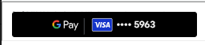

<!-- <h1 align="center">
   <b>
        <a href="#">
        
        </a><br>
    </b>
</h1> -->

<p align="center">The Qenta Datastorage googlepay is use for render the Google pay button by using qenta payment checkout method. </p>
    <p>
        <a href="#">
            
        </a>
        <a href="#">
            
        </a>
        <a href="#">
            
        </a>
    </p>
<p align="center">
    <a href="https://qenta.com/"><b>Website</b></a> •
    <a href="#"><b>Documentation</b></a>
</p>

<div align="center">

</div>

## Table of Contents
  - [Features](#Features)
  - [Browser Support](#Browser-Support)
  - [Installing](#installing)
  - [Example](#example)
  - [Return Result](#Return-Result)
  - [Resources](#Resources)
  - [Supported language](#Supported-language)
  - [License](#license)
  - [Acknowledgments](#acknowledgments)

## Features

Render the Googlepay button Compatible for : 
-  React js
-  Vue js
-  Angular js

## Browser Support

 |  |  |  |  |  |
--- | --- | --- | --- | --- | --- |
Latest ✔ | Latest ✔ | Latest ✔ | Latest ✔ | Latest ✔ | 11 ✔ |
## Installing

Using npm:

```bash
$ npm i qenta-datastorage-googlepay
```

Using yarn:

```bash
$ yarn add qenta-datastorage-googlepay
```

Once the package is installed, you can import the library using `import` approach:

```js
import DsGooglepay from 'qenta-datastorage-googlepay';
```

## Example

Include a section with usage examples to help users understand how to apply your package in different scenarios.

This are the Property you need to pass.

| Property  |  Definition   | Example |
| -------- | ----------  | ------ |
| secret * | It's your qenta's secret key. | - |
| customerId * | It's your qenta's customerId. | - |
| shopId *| It's your qenta's shopId. | - |
| language *| if you want to change your local language by default we use english. | en / de / it / fr / es |
| amount *| It's your payment amount. | 1, 10 or any number |
| currency *| It's your local currency. | INR,USD,EUR |
| countrycode *| It's your local countrycode. | INR,USD,EUR |
| returnurl *| It's your url init payment file to qenta. | http://localhost/frontend/init.php |


Example in `React js`

```js
import DsGooglepay from 'qenta-datastorage-googlepay';

        <DsGooglepay
          secret={'your_secret'}
          customerid={'your_customerid'}
          shopid={'your_shopid'}
          language={'language'} 
          amount={'your_checkout_amount'}
          currency={'your_currency'} //eg. EUR / USD 
          countrycode={'your_countrycode'} //eg. AT / US 
          returnurl={'http://localhost/frontend/init.php'}
        />  

```

Example in `Vue js`

```js
import DsGooglepay from 'qenta-datastorage-googlepay';
      export default {
      name: 'App',
      components: {
          DsGooglepay
      }
  }

  <template>
      <DsGooglepay
        :secret="'your_secret'"
        :customerid="'your_customerid'"
        :shopid="'your_shopid'"
        :language="'language'"
        :amount="'your_checkout_amount'"
        :currency="'your_currency'"
        :countrycode="'your_countrycode'"
        :returnurl="'http://localhost/frontend/init.php'"
      />
  </template>
```

Example in `Angular js`

Inside your `.Ts File` Add below code
```js
import DsGooglepay from 'qenta-datastorage-googlepay';

export class AppComponent {
    props :any = {
        secret:'your_secret',
        customerid:'your_customerid',
        shopid:'your_shopid',
        language:'language',
        amount:'your_checkout_amount',
        currency='currency',
        countrycode='your_countrycode',
        returnurl='http://localhost/frontend/init.php'
    };

    ocrGpayHtml: string;

    constructor() {
        this.ocrGpayHtml = DsGooglepay(this.props);
    }
}
```
Inside your `.Html File` Add below code

```Html
<div [innerHTML]="ocrGpayHtml"></div>
```

## Return Result

 Example the iframe with googleplay button : 




beside iframe, it will also return storageId parameters

- [storageId](https://guides.qenta.com/parameters/detailed-description/#storageId)

get storageId from hidden input value by using id="storageId".

e.g.,

```Html
<input type="hidden" id="storageId" storageid="f34a9f4c612b6b0bf31a717e11xxxxxx">
``` 
## Resources

* [qenta](https://qenta.com/)

## Supported language

This package supported in 
- [Reactjs](https://react.dev/) 
- [vuejs](https://vuejs.org/)
- [AngularJS](https://angularjs.org/)

## License

This project is licensed under the License Name - see the [LICENSE](LICENSE) file for details.

## acknowledgments
If your package relies on other open-source projects or you want to give credit to contributors, include an acknowledgments section.